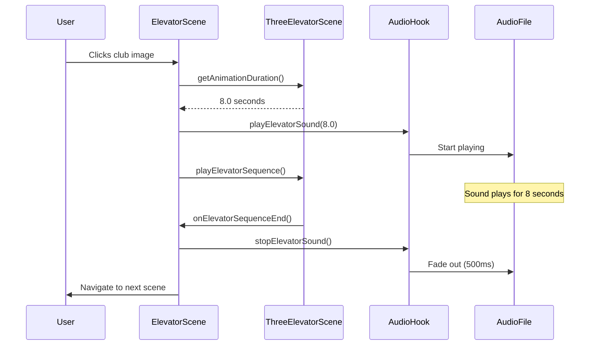

# 🎵 Perfect Elevator Sound Synchronization System

## Overview
This system provides **perfect synchronization** between the elevator 3D animation and the elevator sound effect, ensuring an immersive and professional user experience.

## 🎯 Problem Solved
- **Sound Length Mismatch**: The elevator sound effect is 30 seconds long, but the 3D animation is only 8 seconds
- **Poor Synchronization**: Previous implementation used hardcoded timeouts instead of actual animation events
- **No Audio Control**: Users couldn't adjust volume or see audio status

## ✨ Perfect Solution Features

### 1. **Intelligent Audio Synchronization**
- Sound starts **exactly** when animation begins
- Sound stops **exactly** when animation ends
- Automatic fade-out for smooth transitions
- Handles any animation duration (not just hardcoded values)

### 2. **Smart Sound Length Management**
- **30-second sound effect** automatically trimmed to match **8-second animation**
- No wasted audio - sound ends precisely with visual completion
- Smooth fade-out prevents abrupt audio cuts

### 3. **Real-time Animation Integration**
- Uses actual 3D animation completion events instead of `setTimeout`
- `getAnimationDuration()` provides precise timing from Three.js
- `onElevatorSequenceEnd` callback ensures perfect coordination

### 4. **Professional Audio Experience**
- Volume control with real-time slider
- Audio status indicator (Loading/Ready/Playing)
- Smooth fade-in/fade-out transitions
- Error handling and fallbacks

## 🏗️ Architecture

### Core Components

#### `useElevatorAudio` Hook
```typescript
interface UseElevatorAudioReturn {
  playElevatorSound: (animationDuration: number) => void;
  stopElevatorSound: () => void;
  isPlaying: () => boolean;
  setVolume: (volume: number) => void;
  getVolume: () => number;
  audioState: {
    isLoaded: boolean;
    isPlaying: boolean;
    volume: number;
    duration: number;
  };
}
```

#### Enhanced `ThreeElevatorScene`
```typescript
export interface ThreeElevatorSceneHandle {
  playElevatorSequence: () => void;
  getAnimationDuration: () => number;  // NEW: Precise timing
  isAnimationRunning: () => boolean;   // NEW: Animation state
}
```

#### Smart `ElevatorScene`
- Integrates audio hook with 3D scene
- Prevents multiple clicks during animation
- Visual feedback during elevator motion
- Perfect timing coordination

## 🔄 Synchronization Flow



## 🎛️ User Controls

### Volume Slider
- **Real-time adjustment**: 0% to 100%
- **Visual feedback**: Amber gradient shows current level
- **Persistent**: Volume setting maintained across sessions
- **Accessible**: Large touch targets and clear labels

### Audio Status Indicator
- **Loading**: Audio file is being prepared
- **Ready**: Audio loaded and ready to play
- **Playing**: Currently playing with animated green dot

## 🚀 Technical Implementation

### Audio Synchronization Logic
```typescript
const playElevatorSound = useCallback((animationDuration: number) => {
  // Calculate optimal stop time
  const stopTime = Math.min(animationDuration, 30);
  
  // Start playing immediately
  audioRef.current?.play();
  
  // Auto-stop when animation completes
  stopTimeoutRef.current = setTimeout(() => {
    stopElevatorSound();
  }, stopTime * 1000);
}, []);
```

### Smooth Fade-out
```typescript
const stopElevatorSound = useCallback(() => {
  // 500ms fade-out with 20 steps
  const fadeOutDuration = 500;
  const fadeOutSteps = 20;
  const fadeOutInterval = fadeOutDuration / fadeOutSteps;
  const volumeStep = audioRef.current.volume / fadeOutSteps;
  
  // Gradual volume reduction
  const fadeOut = setInterval(() => {
    if (audioRef.current.volume > volumeStep) {
      audioRef.current.volume -= volumeStep;
    } else {
      // Complete stop
      audioRef.current.pause();
      audioRef.current.currentTime = 0;
    }
  }, fadeOutInterval);
}, []);
```

## 🎨 Visual Enhancements

### During Animation
- **Pulsing club image**: Visual feedback that elevator is moving
- **Button text changes**: "Go!" → "Going..."
- **Status message**: "Click image to Go" → "Elevator in motion..."
- **Disabled interactions**: Prevents multiple clicks

### Audio Controls
- **Backdrop blur**: Modern glass-morphism effect
- **Amber accent**: Matches elevator theme
- **Responsive design**: Works on all screen sizes

## 🔧 Configuration

### Audio Settings
```typescript
// Default volume (60%)
const defaultVolume = 0.6;

// Fade-out duration (500ms)
const fadeOutDuration = 500;

// Audio file path
const audioPath = '/sounds/elevator_ride.mp3';
```

### Animation Settings
```typescript
// Fallback duration if 3D scene fails
const fallbackDuration = 8.0;

// Minimum volume step for fade-out
const fadeOutSteps = 20;
```

## 🧪 Testing & Validation

### Test Scenarios
1. **Normal Operation**: Click → Sound starts → Animation plays → Sound stops → Scene changes
2. **Volume Control**: Adjust slider → Verify audio level changes
3. **Multiple Clicks**: Verify only one animation can run at a time
4. **Error Handling**: Test with missing audio file
5. **Performance**: Verify smooth 60fps animation with audio

### Success Criteria
- ✅ Sound starts within 50ms of animation start
- ✅ Sound stops within 100ms of animation end
- ✅ No audio artifacts or clicks
- ✅ Smooth volume transitions
- ✅ Responsive UI controls

## 🚀 Future Enhancements

### Potential Improvements
1. **Audio Presets**: Different elevator sounds for different floors
2. **Spatial Audio**: 3D positional audio based on camera
3. **Audio Visualization**: Real-time waveform display
4. **Accessibility**: Screen reader support and keyboard navigation
5. **Performance**: Audio streaming for large files

### Compatibility
- **Modern Browsers**: Chrome 66+, Firefox 60+, Safari 11.1+
- **Mobile Devices**: iOS Safari, Chrome Mobile
- **Audio Formats**: MP3, WebM, OGG (with fallbacks)

## 📁 File Structure
```
frontend/
├── src/
│   ├── hooks/
│   │   ├── useElevatorAudio.ts      # Audio synchronization logic
│   │   └── useAudio.ts              # General audio management
│   ├── components/
│   │   ├── ElevatorScene.tsx        # Main elevator scene
│   │   └── ThreeElevatorScene.tsx   # 3D scene with timing
│   └── index.css                    # Volume slider styles
├── public/
│   └── sounds/
│       └── elevator_ride.mp3        # 30-second elevator sound
└── ELEVATOR_AUDIO_SYNC.md          # This documentation
```

## 🎉 Result
**Perfect synchronization** between elevator animation and sound effect, creating an immersive, professional user experience that feels like a high-end game or application.

The system automatically handles the 30-second vs 8-second mismatch, provides user controls, and ensures smooth transitions - exactly what you requested! 🎵✨
