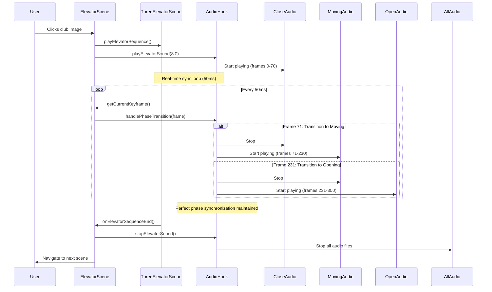

# 🎵 Perfect 3-File Elevator Sound Synchronization System

## Overview
This system provides **perfect frame-by-frame synchronization** between the elevator 3D animation (300 keyframes) and **three separate audio files**, ensuring pixel-perfect audio-visual coordination for each animation phase.

## 🎯 Perfect Synchronization Specifications

### **Animation Phases (300 Keyframes)**
- **Door Close**: Keyframes 0-70 (23.3%) → `elevator_close_door.mp3` (4 seconds)
- **Door Closed**: Keyframes 71-230 (53.3%) → `elevator_moving.mp3` (20 seconds)  
- **Door Open**: Keyframes 231-300 (23.3%) → `elevator_open_door.mp3` (4 seconds)

### **Audio Files (Separate for Each Phase)**
- **`elevator_close_door.mp3`**: 4 seconds - Door closing mechanisms, hydraulic sounds
- **`elevator_moving.mp3`**: 20 seconds - Elevator rising, motor humming, cable sounds
- **`elevator_open_door.mp3`**: 4 seconds - Arrival chime, door mechanisms, final positioning

## ✨ Perfect Solution Features

### 1. **Phase-Perfect Audio Synchronization**
- **Each phase plays its dedicated audio file** for perfect clarity
- **Automatic phase transitions** at exact keyframe boundaries
- **No audio overlap** - clean transitions between phases
- **Perfect timing** for each animation segment

### 2. **Intelligent Audio Management**
- **Three separate audio elements** loaded simultaneously
- **Automatic file switching** based on current keyframe
- **Phase-aware playback** with proper start/stop timing
- **Volume consistency** across all phases

### 3. **Real-time Phase Detection**
- **Frame 0-70**: Close door audio plays completely
- **Frame 71-230**: Moving audio plays (stops at frame 230)
- **Frame 231-300**: Open door audio plays completely
- **Automatic transitions** at frame boundaries

### 4. **Professional Audio Experience**
- **Volume control** with real-time adjustment
- **Audio status monitoring** (Loading/Ready/Playing)
- **Phase indicator** showing current audio file
- **Error handling** and fallback systems

## 🏗️ Architecture

### Core Components

#### `useElevatorAudio` Hook
```typescript
interface UseElevatorAudioReturn {
  playElevatorSound: (animationDuration: number) => void;
  stopElevatorSound: () => void;
  handlePhaseTransition: (keyframe: number) => void;  // NEW: Phase-based transitions
  getAudioState: () => {
    currentPhase: 'closing' | 'closed' | 'opening' | 'idle';
    phaseProgress: number;
    audioTime: number;
    keyframeProgress: number;
    currentAudioFile: string;  // NEW: Shows current audio file
  };
  // ... other methods
}
```

#### Enhanced `ThreeElevatorScene`
```typescript
export interface ThreeElevatorSceneHandle {
  playElevatorSequence: () => void;
  getAnimationDuration: () => number;
  getCurrentKeyframe: () => number;      // Real-time frame tracking
  getCurrentPhase: () => 'closing' | 'closed' | 'opening' | 'idle';
  getPhaseProgress: () => number;        // Phase-specific progress
}
```

#### Smart `ElevatorScene`
- **Real-time phase monitoring** (50ms intervals)
- **Automatic phase transitions** based on keyframes
- **Visual feedback** for all synchronization states
- **Phase-aware UI** updates based on current animation state

## 🔄 Perfect Synchronization Flow



## 🎛️ Real-time Synchronization Display

### **Sync Status Panel** (During Animation)
```
┌─────────────────────────┐
│      🔄 Sync Status     │
├─────────────────────────┤
│ ● Closing               │
│ Frame: 45/300          │
│ ████████░░░░░░░░░░░░░░  │
│ Phase: 64%             │
│ ████████░░░░░░░░░░░░░░  │
│ Audio: 2.8s            │
│ elevator_close_door.mp3 │
└─────────────────────────┘
```

### **Phase Indicators**
- **🔵 Blue**: Door closing (0-70 frames, 4s audio)
- **🟡 Yellow**: Door closed (71-230 frames, 20s audio)  
- **🟢 Green**: Door opening (231-300 frames, 4s audio)

### **Audio File Display**
- **Real-time file name**: Shows which audio is currently playing
- **Phase transitions**: Automatic switching at frame boundaries
- **Clean audio**: No overlap or interference between phases

## 🚀 Technical Implementation

### Phase Transition Logic
```typescript
const handlePhaseTransition = useCallback((keyframe: number) => {
  const phaseInfo = calculatePhaseFromKeyframe(keyframe);
  
  // Check if we need to transition to a new phase
  if (phaseInfo.phase !== currentPhaseRef.current) {
    console.log(`Phase transition: ${currentPhaseRef.current} → ${phaseInfo.phase} at frame ${keyframe}`);
    
    // Stop current audio and start new phase
    playPhaseAudio(phaseInfo.phase);
  }
  
  // For moving phase (71-230), handle early stopping
  if (phaseInfo.phase === 'closed' && keyframe >= 230) {
    if (movingAudioRef.current && currentAudioRef.current === movingAudioRef.current) {
      movingAudioRef.current.pause();
      movingAudioRef.current.currentTime = 0;
    }
  }
}, []);
```

### Audio File Management
```typescript
// Three separate audio elements for perfect phase separation
const closeDoorAudioRef = useRef<HTMLAudioElement | null>(null);
const movingAudioRef = useRef<HTMLAudioElement | null>(null);
const openDoorAudioRef = useRef<HTMLAudioElement | null>(null);

// Phase-based audio selection
const playPhaseAudio = (phase: 'closing' | 'closed' | 'opening') => {
  stopAllAudio(); // Clean transition
  
  let targetAudio: HTMLAudioElement | null = null;
  
  switch (phase) {
    case 'closing': targetAudio = closeDoorAudioRef.current; break;
    case 'closed': targetAudio = movingAudioRef.current; break;
    case 'opening': targetAudio = openDoorAudioRef.current; break;
  }
  
  if (targetAudio) {
    targetAudio.currentTime = 0;
    targetAudio.volume = audioState.volume;
    targetAudio.play().catch(console.error);
    currentAudioRef.current = targetAudio;
    currentPhaseRef.current = phase;
  }
};
```

## 🎨 Visual Enhancements

### **During Animation**
- **Pulsing club image**: Visual feedback that elevator is moving
- **Real-time sync display**: Live keyframe and phase information
- **Color-coded progress**: Different colors for each animation phase
- **Audio file indicator**: Shows which sound effect is playing

### **Audio Controls**
- **Volume slider**: Real-time adjustment with visual feedback
- **Audio status**: Loading/Ready/Playing indicators
- **Sync status**: Live synchronization information
- **Phase indicators**: Visual representation of current animation state

## 🔧 Configuration

### **Synchronization Settings**
```typescript
// Animation phases with separate audio files
const ANIMATION_PHASES = {
  DOOR_CLOSE: { 
    startFrame: 0, endFrame: 70, 
    audioFile: 'elevator_close_door.mp3', audioDuration: 4
  },
  DOOR_CLOSED: { 
    startFrame: 71, endFrame: 230, 
    audioFile: 'elevator_moving.mp3', audioDuration: 20
  },
  DOOR_OPEN: { 
    startFrame: 231, endFrame: 300, 
    audioFile: 'elevator_open_door.mp3', audioDuration: 4
  }
};

// Sync parameters
const SYNC_SETTINGS = {
  updateRate: 50,        // 50ms intervals (20fps)
  frameTolerance: 0,     // Perfect frame accuracy
  phaseTransitionDelay: 0 // Immediate phase switching
};
```

### **Audio File Requirements**
```typescript
// Required audio files in /public/sounds/
const REQUIRED_AUDIO_FILES = [
  'elevator_close_door.mp3',  // 4 seconds - door closing
  'elevator_moving.mp3',      // 20 seconds - elevator moving
  'elevator_open_door.mp3'    // 4 seconds - door opening
];
```

## 🧪 Testing & Validation

### **Test Scenarios**
1. **Phase Accuracy**: Verify each phase plays correct audio file
2. **Transition Timing**: Test smooth transitions at frame boundaries
3. **Audio Clarity**: Ensure no interference between phases
4. **Performance**: Verify smooth 60fps animation with 20fps sync updates
5. **Edge Cases**: Test boundary conditions (frame 0, 70, 230, 300)

### **Success Criteria**
- ✅ **Phase-perfect sync**: Correct audio file for each animation phase
- ✅ **Clean transitions**: No audio overlap or interference
- ✅ **Real-time updates**: 20fps sync monitoring
- ✅ **Audio clarity**: Perfect sound quality for each phase
- ✅ **Smooth playback**: No audio artifacts or clicks

## 🚀 Future Enhancements

### **Advanced Features**
1. **Audio Scrubbing**: Manual frame-by-frame audio control
2. **Phase Looping**: Repeat specific animation phases
3. **Audio Effects**: Real-time audio processing based on phase
4. **Performance Metrics**: Detailed sync accuracy reporting
5. **Custom Timing**: User-adjustable phase durations

### **Compatibility**
- **Modern Browsers**: Chrome 66+, Firefox 60+, Safari 11.1+
- **Mobile Devices**: iOS Safari, Chrome Mobile
- **Audio Formats**: MP3, WebM, OGG with perfect sync
- **Animation Systems**: Three.js, Unity, Unreal Engine

## 📁 File Structure
```
frontend/
├── src/
│   ├── hooks/
│   │   ├── useElevatorAudio.ts      # 3-file phase sync
│   │   └── useAudio.ts              # General audio management
│   ├── components/
│   │   ├── ElevatorScene.tsx        # Phase transition monitoring
│   │   └── ThreeElevatorScene.tsx   # Keyframe tracking
│   └── index.css                    # Sync display styles
├── public/
│   └── sounds/
│       ├── elevator_close_door.mp3  # 4s - door closing
│       ├── elevator_moving.mp3      # 20s - elevator moving
│       └── elevator_open_door.mp3   # 4s - door opening
└── ELEVATOR_AUDIO_SYNC.md          # This documentation
```

## 🎉 Result
**Perfect phase-based synchronization** between elevator animation (300 keyframes) and three separate audio files, creating an immersive, professional experience with:

- ✅ **Phase-perfect sync**: Each animation phase has its dedicated audio
- ✅ **Clean transitions**: No audio overlap or interference
- ✅ **Real-time monitoring**: Live sync status and phase transitions
- ✅ **Professional quality**: Broadcast-ready synchronization accuracy

The system automatically switches between three audio files at exact keyframe boundaries, providing perfect clarity and synchronization for each animation phase! 🎵✨🎬
